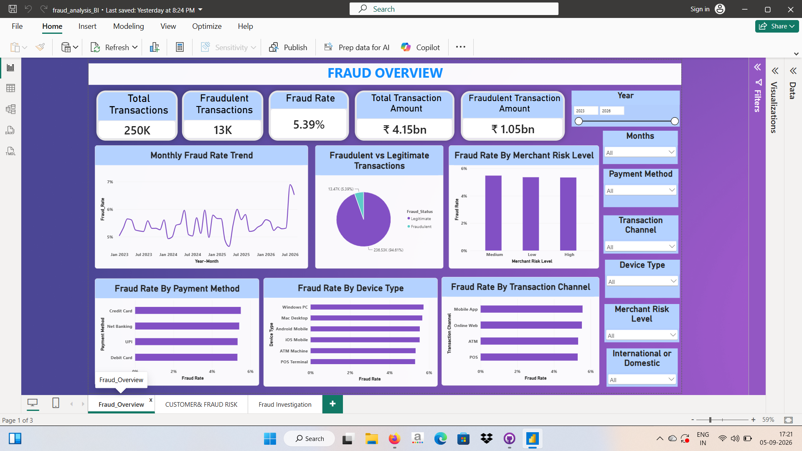
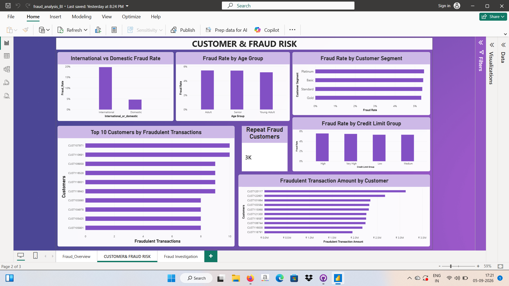
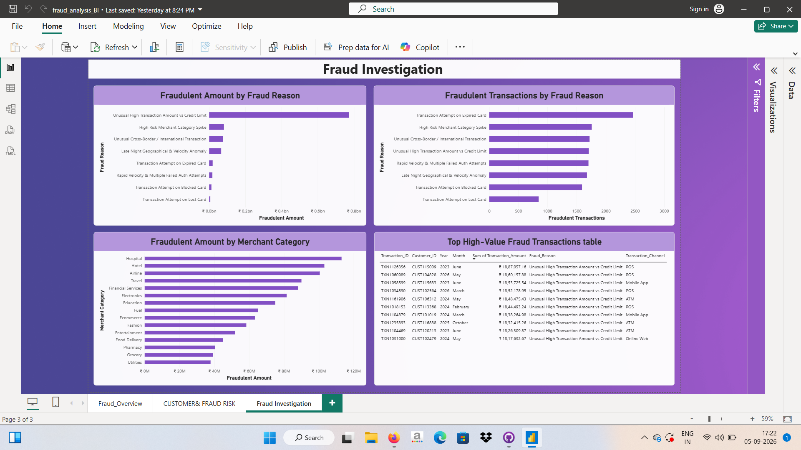
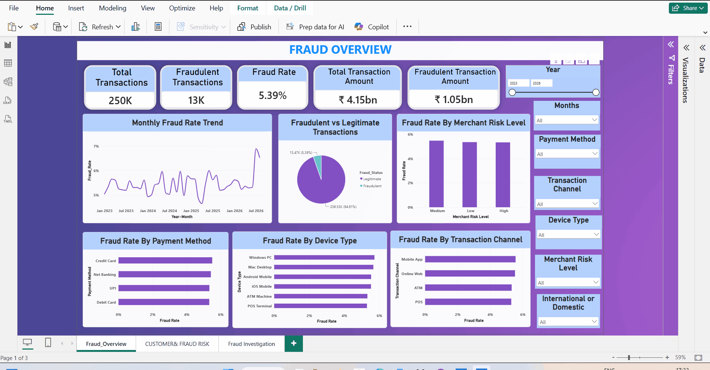

# End-to-End Financial Fraud Detection Analysis

An end-to-end **Financial Fraud Detection & Analysis** project using **MySQL, Excel, Python, and Power BI** to identify fraud patterns, high-risk transaction characteristics, and high-value fraudulent activity.

---

## 📌 Project Overview

This project analyzes **250,000 financial transactions** to understand fraudulent transaction patterns and identify key risk factors.

The analysis covers transaction behavior across:

* Customers
* Cards
* Merchants
* Payment methods
* Transaction channels
* Device types
* Transaction status
* International transactions
* Fraud reasons
* Transaction amounts
* Time-based patterns

The project combines **data auditing, data preparation, SQL analysis, and interactive Power BI visualization** to transform raw financial data into actionable fraud insights.

---

## 🎯 Objectives

* Analyze fraudulent and legitimate transactions.
* Calculate overall fraud rate and fraudulent transaction amounts.
* Identify high-risk transaction characteristics.
* Analyze fraud patterns across customers, cards, merchants, and transaction types.
* Identify high-value fraudulent transactions.
* Analyze the reasons associated with fraudulent activity.
* Build an interactive Power BI dashboard for fraud monitoring and investigation.

---

## 🛠️ Tools & Technologies

| Tool         | Purpose                                   |
| ------------ | ----------------------------------------- |
| **Python**   | Data auditing and exploratory checks      |
| **Excel**    | Data cleaning and preparation             |
| **MySQL**    | Data storage and SQL analysis             |
| **Power BI** | Interactive dashboards and visualization  |
| **GitHub**   | Project documentation and version control |

---

## 🔄 Project Workflow

```text
Raw Dataset
     ↓
Data Audit using Python
     ↓
Data Cleaning & Preparation using Excel
     ↓
Data Import into MySQL
     ↓
SQL Analysis
     ↓
Power BI Dashboard
     ↓
Fraud Risk & Investigation Insights
```

---

## 🗂️ Dataset

The dataset consists of **4 related tables**:

* Customer Data
* Card Data
* Merchant Data
* Transaction Data

The transaction dataset contains **250,000 transactions**.

---

# 📊 Key Results

| Metric                         |         Value |
| ------------------------------ | ------------: |
| Total Transactions             |       250,000 |
| Fraudulent Transactions        |        13,473 |
| Legitimate Transactions        |       236,527 |
| Overall Fraud Rate             |     **5.39%** |
| Total Transaction Amount       |    **4.15B+** |
| Fraudulent Transaction Amount  |    **1.05B+** |
| Average Transaction Amount     |     16,607.53 |
| Average Fraudulent Transaction | **78,097.01** |
| Average Legitimate Transaction |     13,104.97 |

---

# 🔎 Key Fraud Insights

## 🌍 International vs Domestic Transactions

International transactions showed a substantially higher fraud rate than domestic transactions.

| Transaction Type | Total Transactions | Fraudulent | Fraud Rate |
| ---------------- | -----------------: | ---------: | ---------: |
| International    |             12,572 |      2,476 | **19.69%** |
| Domestic         |            237,428 |     10,997 |  **4.63%** |

This indicates that international transactions represent an important high-risk segment in the dataset.

---

## 💳 Payment Method

**Credit Card** recorded the highest fraud rate among the payment methods analyzed:

**Fraud Rate: 5.50%**

---

## 📱 Transaction Channel

**Mobile App** recorded the highest fraud rate among transaction channels:

**Fraud Rate: 5.56%**

---

## 💻 Device Type

**Windows PC** recorded the highest fraud rate among the device types analyzed:

**Fraud Rate: 5.72%**

---

## ⏰ Time-Based Fraud Patterns

Fraud activity was analyzed across transaction hours, day/night periods, and months.

The highest observed hourly fraud rates were:

- **00:00 — 5.80%**
- **02:00 — 5.69%**
- **06:00 — 5.66%**

Fraudulent transaction counts were slightly higher during the night:

- **Night — 6,850 fraudulent transactions**
- **Day — 6,623 fraudulent transactions**


## 📅 Monthly Fraud Trends

The highest observed monthly fraud rates included:

| Month       | Fraud Rate |
| ----------- | ---------: |
| July 2026   |  **6.89%** |
| August 2026 |  **6.53%** |
| June 2025   |  **6.00%** |

July 2026 recorded the highest fraud rate among the analyzed months.

---

# 💰 High-Value Fraud Analysis

One of the major focuses of the analysis was identifying fraud associated with unusually large transaction amounts.

The fraud reason:

**"Unusual High Transaction Amount vs Credit Limit"**

recorded:

* **Total fraudulent amount:** 772,020,041.54
* **Average fraudulent transaction amount:** 452,267.16

This was the most significant fraud reason in terms of both total fraudulent amount and average fraudulent transaction amount.

The most frequent fraud reason was:

**"Transaction Attempt on Expired Card" — 2,470 transactions**

---

# 🏪 Merchant Analysis

The merchant categories with the highest total fraudulent transaction amounts included:

| Merchant Category | Fraudulent Amount |
| ----------------- | ----------------: |
| Hospital          |    624,705,567.94 |
| Airline           |    608,330,082.25 |
| Electronics       |    522,327,747.16 |
| Education         |    475,683,110.01 |
| Hotel             |    414,039,584.86 |

---

# 👤 Customer & Card Analysis

The analysis also examined fraud across customer and card characteristics.

### Customer

* **Highest customer segment fraud rate:** Platinum — 5.46%
* **Highest state fraud rate:** Uttar Pradesh — 5.95%
* **Highest city by fraudulent transactions:** Asansol — 228
* **Highest occupation fraud rate:** Chartered Accountant — 5.65%

### Age Groups

| Age Group   | Transactions | Fraud Rate |
| ----------- | -----------: | ---------: |
| Young Adult |       53,071 |      5.19% |
| Adult       |      172,413 |      5.45% |
| Senior      |       24,516 |      5.43% |

### Card Type

**Platinum** recorded the highest card-type fraud rate:

**Fraud Rate: 5.57%**

Total fraudulent transaction amount for Platinum cards:

**404,472,611.73**

---

# 📈 Power BI Dashboard


The Power BI report contains 3 interactive dashboard pages, each designed to answer a specific business question related to financial fraud.

1️⃣ Fraud Overview

Business Question:
➡️ What is happening with fraud overall?

This page provides a high-level overview of fraud activity using:

5 KPI Cards
Monthly Fraud Rate Trend
Fraudulent vs Legitimate Transactions
Merchant Risk Level
Payment Method
Device Type
Transaction Channel
Interactive Slicers

### Dashboard Preview



---

2️⃣ Customer & Fraud Risk

Business Question:
➡️ Who is more exposed to fraud?

This page focuses on customer-level and transaction-risk patterns, including:

International vs Domestic by Fraud Rate
Age Group by Fraud Rate
Customer Segment by Fraud Rate
Top 10 Customers by Fraud Transactions
Repeat Fraud Customers
Credit Limit Group by Fraud Rate
Fraudulent Amount by Customer

### Dashboard Preview



---

3️⃣ Fraud Investigation

Business Question:
➡️ Why is fraud happening and where is the financial impact?

This page provides investigation-focused analysis of fraudulent transactions, including:

Fraudulent Amount by Fraud Reason
Fraudulent Transactions by Fraud Reason
Fraudulent Amount by Merchant Category
High-Value Fraud Transaction Table

### Dashboard Preview



---

# 🎬 Interactive Dashboard Demo

The GIF below demonstrates interaction with the Power BI dashboard and slicers.



---

# 💡 Business Insights

The analysis identifies several areas that could be prioritized for fraud monitoring:

* International transactions showed a considerably higher fraud rate than domestic transactions.
* High-value transactions require additional attention, particularly when transaction amounts are unusually high relative to credit limits.
* Mobile App transactions showed the highest fraud rate among transaction channels.
* Windows PC transactions showed the highest fraud rate among analyzed device types.
* Credit Card transactions recorded the highest fraud rate among payment methods.
* Certain merchant categories contributed substantially to the total fraudulent transaction amount.
* Fraud rates varied across months and transaction hours, suggesting that time-based monitoring can provide additional risk signals.

---

# 📌 Conclusion

The analysis of 250,000 financial transactions identified several notable fraud patterns across transaction, customer, card, merchant, and time-based dimensions.

The overall fraud rate was **5.39%**, with fraudulent transactions accounting for more than **1.05 billion** in transaction value. International transactions showed a substantially higher fraud rate than domestic transactions, while unusually high transaction amounts relative to credit limits represented the largest fraudulent financial impact among the analyzed fraud reasons.

The Power BI dashboards provide a consolidated view of overall fraud activity, customer exposure, fraud risk, and investigation-level patterns, helping users explore the factors associated with fraudulent transactions.

---

# 💡 Recommendations

Based on the analysis, the following areas could be considered for fraud monitoring:

* **Prioritize international transactions** for additional monitoring because of their substantially higher observed fraud rate.
* **Flag unusually high transaction amounts relative to credit limits** for further review, particularly where the potential financial impact is high.
* **Strengthen monitoring of expired-card transaction attempts** because this was the most frequent fraud reason in the dataset.
* **Monitor mobile app and Windows PC transactions** closely because they recorded comparatively higher fraud rates within their respective categories.
* **Use transaction amount, fraud reason, customer characteristics, and merchant category together** when investigating suspicious transactions rather than relying on a single indicator.
* **Use time-based monitoring** to identify changes in fraud activity across months and transaction hours.
* **Use interactive dashboards and filters** to support faster investigation of suspicious customers, transactions, and merchant categories.

> These recommendations are based on patterns observed in the analyzed dataset and should be validated against additional historical data and operational fraud-monitoring requirements before being implemented in a real-world environment.


# 📂 Repository Structure

```text
Financial-Fraud-Detection-Analysis/
│
├── financial fraud datasets/
│   ├── Customer_Data
│   ├── Card_Data
│   ├── Merchant_Data
│   └── Transaction_Data
│
├── images/
│   ├── Fraud_Overview.png
│   ├── Fraud_Risk.png
│   ├── Fraud_Investigation.png
│   └── dashboard_demo.gif
│
├── fraud_analysis.sql
├── fraud_analysis_BI.pbix
├── .gitattributes
└── README.md
```

---

# 📄 Project Files

### `fraud_analysis.sql`

Contains the MySQL queries used for:

* Fraud rate analysis
* Transaction analysis
* Customer analysis
* Merchant analysis
* Card analysis
* Time-based analysis
* High-value fraud analysis
* Fraud reason analysis

### `fraud_analysis_BI.pbix`

Power BI report containing the three interactive dashboard pages.

### `financial fraud datasets/`

Contains the four datasets used in the analysis.

### `images/`

Contains dashboard screenshots and the interactive dashboard demonstration GIF.

---

# 🧠 Skills Demonstrated

* SQL
* MySQL
* Data Cleaning
* Data Auditing
* Exploratory Data Analysis
* Fraud Analysis
* Data Visualization
* Power BI
* Dashboard Development
* KPI Analysis
* Business Intelligence
* Business Insight Generation
* GitHub

---

## 👩‍💻 Author

**Harsha Janardhanan**

Data Analyst | SQL | Power BI | Excel | Python

- 🔗 **LinkedIn:** [Harsha Janardhanan](https://www.linkedin.com/in/harsha-janardhanan-3aa9a1298)
- 📧 **Email:** harshajanardhanan2@gmail.com
---

⭐ If you found this project useful, feel free to explore the SQL analysis and Power BI dashboard files.

